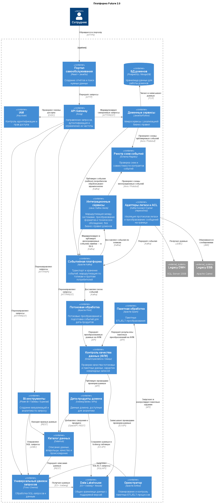

# Задание 3. Проектирование целевой архитектуры и оценка рисков внедрения

## 1. Архитектура «Будущее 2.0»: план на три года

### 1.1. Диаграмма C4

### 1.2. Как изменятся ключевые системы

| Компонент сегодня | Целевое решение | Причина и способ перехода |
|---|---|---|
| DWH на SQL Server 2008 | Оставить только для архива или ACL, затем вывести из активного использования. | Перейти к Data Mesh: каждый домен отвечает за собственные данные, а аналитические витрины формируются на основе событий. Такой подход уменьшает связанность систем и упрощает изменения. |
| Power BI с доработками | Сохранить как один из BI-инструментов и подключить к порталу самообслуживания. | Перенести специальные функции в дата-продукты доменов либо реализовать их на портале. |
| ESB на Apache Camel | На переходном этапе оставить только как часть адаптеров легаси, затем отключить. | Обязанности ESB распределить между API Gateway, событийной платформой, интеграционными сервисами, конвейерами обработки данных и доменными сервисами. Kafka обеспечивает транспорт событий. |
| ИИ-сервисы на Python | Выделить в самостоятельные домены, например AI Diagnostics, с API и публикацией событий. | Связать их с остальными доменами через события, а обучающие данные получать из Data Lakehouse. |
| Финтех-сервисы на Golang и Java | Разделить на микросервисы по направлениям: кредиты, платежи и счета; для каждого предусмотреть собственную базу данных. | Это даст доменам большую автономность и позволит масштабировать их независимо. |
| Медицинская система на PowerBuilder и DWH | Перейти на современную медицинскую информационную систему с микросервисной и событийной архитектурой. | Мигрировать поэтапно, сохраняя нужные функции через ACL. |
| Портала самообслуживания нет | Создать портал, на котором сотрудники бизнеса смогут самостоятельно собирать отчёты. | Ускорить получение аналитики и уменьшить очередь запросов к ИТ. |

### Новые направления бизнеса

Фармацевтика и производство оборудования могут подключаться к экосистеме как отдельные домены. Они будут публиковать собственные события и получать события других доменов через событийную платформу. Благодаря этому экосистему можно расширять без переделки уже работающих систем.

### Дополнительные источники данных

Для подключения медицинских устройств и внешних API следует использовать адаптеры, например Kafka Connect. Они преобразуют входящие данные в события и направляют их в соответствующие домены.

### Распределение обязанностей ESB

| Обязанность | Целевой компонент и границы ответственности |
|---|---|
| Синхронная маршрутизация запросов | API Gateway аутентифицирует и направляет HTTP/API-запросы к доменным сервисам, каталогу или движку запросов. |
| Асинхронная маршрутизация событий | Kafka доставляет события по топикам и группам потребителей. Интеграционные сервисы выполняют необходимую маршрутизацию между системами; правила маршрутизации и контракты событий версионируются и управляются явно. |
| Потоковые трансформации | Flink обрабатывает потоки: фильтрация, нормализация, обогащение и подготовка данных для дата-продуктов. Простые протокольные преобразования остаются в адаптерах. |
| Пакетные трансформации | Spark выполняет пакетные ETL/ELT, а Airflow планирует и контролирует запуски. Результаты проходят проверки качества до публикации. |
| ФЛК и качество данных | Schema Registry проверяет структуру и совместимость событий. Адаптеры проверяют формат и обязательные поля на границе; доменные сервисы применяют бизнес-валидации и остаются владельцами правил. Для потоковых и пакетных наборов выполняются проверки качества с карантином невалидных данных и фиксацией причин. |
| Надёжность доставки и обработки | Kafka отвечает за хранение и повторное чтение событий в рамках настроенных гарантий доставки. Потребители обеспечивают идемпотентность; публикация событий согласуется с транзакцией домена через outbox, а интеграционные потоки используют повторные попытки с backoff, тайм-ауты, circuit breaker и DLQ для неисправимых сообщений. |
| Интеграционная логика | Адаптеры и интеграционные сервисы выполняют преобразование протоколов/форматов, техническое обогащение и взаимодействие с легаси.  |

На переходном этапе Camel/Kafka Connect используются как ACL и коннекторы для конкретных легаси-систем. По мере миграции источников адаптеры выводятся; обработка и владение данными переходят к соответствующим доменам.

## 2. Основные риски трансформации

### Технологические и архитектурные

| Риск | Категория | Вероятность | Влияние | Возможное последствие |
|---|---|---:|---:|---|
| Потеря данных при переносе из легаси-систем | Технологический | Средняя | Высокое | История может перенестись не полностью, а при конвертации возможны ошибки. |
| Несогласованные форматы событий | Архитектурный | Средняя | Среднее | Различия в схемах усложнят обмен данными между доменами. |
| Сложное управление доступом и защитой данных | Архитектурный | Высокая | Высокое | Распределённая система усложняет контроль, особенно для медицинской и финансовой информации. |
| Недостаточная пропускная способность событийной платформы | Технологический | Низкая | Среднее | При резком росте потока событий может потребоваться расширить Kafka. |
| Низкая скорость запросов к Data Lakehouse | Технологический | Средняя | Среднее | Без оптимизации сложные запросы будут выполняться слишком долго. |
| Зависимость от облачного поставщика (vendor lock-in) | Технологический | Низкая | Среднее | Применение специфичных сервисов может затруднить перенос между облаками. |
| Нет общих правил для дата-продуктов | Архитектурный | Средняя | Среднее | Разные подходы доменов к витринам осложнят их поиск и использование через портал. |

### Организационные и нормативные

| Риск | Категория | Вероятность | Влияние | Возможное последствие |
|---|---|---:|---:|---|
| Сотрудники не готовы перейти на новые инструменты | Организационный | Высокая | Среднее | Привычка к существующим отчётам может вызвать неприятие нового портала. |
| Миграция затянется из-за поддержки старых систем | Организационный | Средняя | Высокое | Одновременное сопровождение легаси и новых решений отвлечёт ресурсы команды. |
| Нарушение правил работы с медицинскими и финансовыми данными | Организационный | Низкая | Очень высокое | Ошибки в доступах или утечка информации могут привести к санкциям. |

## 3. Как снизить риски

### 3.1. Технические меры

**Перенос данных**

- Подготовить пошаговый план миграции и сверки целостности данных.
- Использовать ETL/ELT-инструменты, позволяющие повторно запускать загрузку.
- Создать резервные копии и проверять результаты после переноса.

**Совместимость событий**

- Подключить Schema Registry и требовать его использования для всех событий.
- Утвердить контракты доменов на архитектурном комитете.
- Выбрать форматы с поддержкой обратной совместимости, например Avro или Protobuf.

**Распределение обязанностей интеграции и надёжность**

- Не размещать маршрутизацию и бизнес-правила в одном центральном интеграционном компоненте: синхронные запросы направлять через API Gateway, события — через Kafka и интеграционные сервисы, бизнес-правила — в доменные сервисы.
- Использовать Flink для потоковых преобразований, Spark для пакетных, а Airflow — только для их расписания и оркестрации.
- Проверять схемы и качество данных на границах конвейеров; невалидные записи изолировать в карантине или DLQ с диагностикой, не теряя исходные данные.
- Для событий применять outbox/inbox или эквивалентный механизм согласованности, идемпотентную обработку, повторные попытки с backoff, тайм-ауты и circuit breaker.
- Определить для каждого потока владельца, SLA, политику повторной обработки и мониторинг задержек, ошибок и объёма DLQ.

**Контроль доступа и защита информации**

- Организовать централизованный IAM с доменными и атрибутивными политиками доступа (ABAC).
- Применять Data Loss Prevention (DLP) для выявления возможных утечек.
- Регулярно проверять права и шифровать данные при хранении и передаче.
- Проектировать систему с учётом GDPR, HIPAA и 152-ФЗ; использовать сертифицированные облачные регионы.
- Проводить плановые пентесты и аудиты безопасности.

**Масштабирование Kafka**

- Заложить резерв производительности и использовать партиционирование.
- Отслеживать нагрузку и настроить автоматическое масштабирование кластера.
- Проверять систему тестами на пиковых объёмах.

**Стандарты дата-продуктов**

- Описать требования к метаданным, форматам и качеству данных.
- Внедрить Data Catalog с автоматической проверкой соответствия этим требованиям.

**Производительность Data Lakehouse**

- Хранить данные в подходящих форматах, например Parquet или ORC, и использовать партиционирование.
- Кэшировать часто запрашиваемые витрины.
- Для сложной аналитики применять MPP-движки, например Presto или ClickHouse.

**Снижение зависимости от поставщика**

- Отдавать предпочтение открытым технологиям и облачно-нейтральным решениям.
- Использовать Terraform и Kubernetes для повышения переносимости.
- Заранее определить стратегию работы с несколькими облачными платформами.

### 3.2. Управленческие меры

**Адаптация сотрудников**

- Проводить обучение и показывать возможности нового портала.
- Привлекать ключевых пользователей к пилотному запуску.
- Отключать старые отчёты постепенно, некоторое время сохраняя доступ к новым и прежним вариантам.

**Контроль сроков**

- Работать итерациями и начать с MVP для одного домена.
- Выделить отдельную команду для поддержки легаси на период миграции.
- Составлять план с учётом зависимостей между работами.

**Соблюдение нормативных требований**

- Подключить специалистов по комплаенсу к проекту с самого начала.
- Регулярно обсуждать выбранный подход с регуляторами.
- Автоматизировать контроль требований, включая проверку обезличивания данных.
